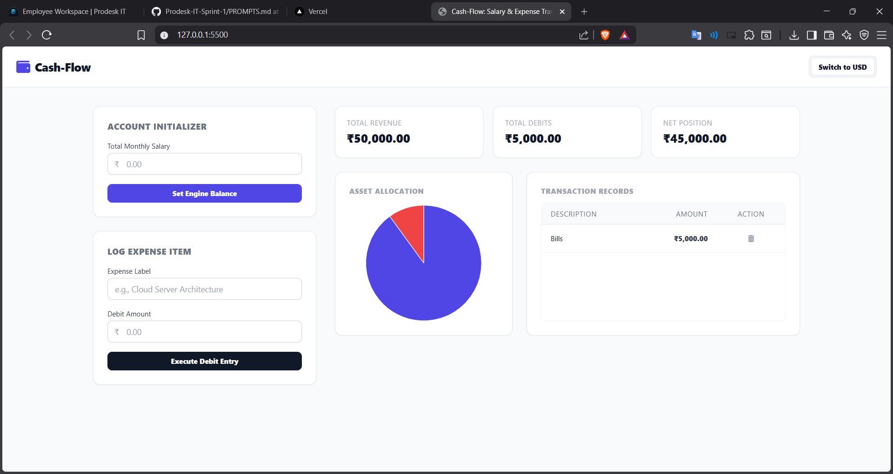

# Cash-Flow: Engineering & Logic Module

A clean, framework-free Salary and Expense Tracker built entirely with pure Vanilla JavaScript and styled using Tailwind CSS. This project focuses on DOM manipulation patterns, state isolation principles, and data serialization mechanics.

🔗 **Live Deployment URL:** https://prodesk-it-sprint-2.vercel.app/

🔗 **GitHub URL:** https://github.com/abhishek-8899/Prodesk-IT-Sprint-2

## 📸 Interface Preview

## 🚀 Engineering Objectives
*   **State Architecture:** Managed application data through a single global `state` object to enforce a single source of truth.
*   **DOM Manipulation:** Manual item creation, container purges, and updates using native DOM API methods.
*   **Persistence Layer:** Utilized JSON data serialization (`JSON.stringify` / `JSON.parse`) to sync metrics with browser `localStorage`.
*   **Data Visualization:** Dynamic pie chart loading using the Chart.js canvas engine.
*   **API Interceptors:** Built asynchronous `fetch` chains to grab live conversion factors from the Frankfurter exchange rate API.

## 📋 Core Features
*   **Phase 1 (Base MVP):** Tracks flat salary pools, captures text-based expense nodes, and manages arithmetic deductions.
*   **Phase 2 (Retention & Deletes):** Preserves logged matrices across manual page reloads. Implemented filter-by-ID record deletion triggers.
*   **Phase 3 (Threat Alert Logic):** 
    *   **Budget Ceiling Alerts:** Shifts interface colors (Red Warning state) automatically if liquid balances dip below 10%.
    *   **Cross-Currency Translation:** Real-time localization toggles for USD and INR states powered by the native `Intl.NumberFormat` engine.

